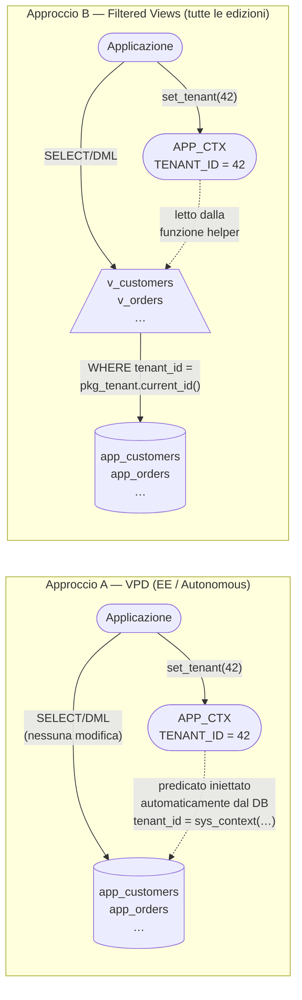

# Multi-Tenant Design with EspreSQL <!-- omit in toc -->

## Table of Contents <!-- omit in toc -->

- [1. Patterns di multi-tenancy](#1-patterns-di-multi-tenancy)
- [2. Scelta dell'approccio: EE/Autonomous vs Standard Edition](#2-scelta-dellapproccio-eeautonomous-vs-standard-edition)
- [3. Il setting `tenantid` in EspreSQL](#3-il-setting-tenantid-in-espresql)
- [4. Oggetti supra-tenant](#4-oggetti-supra-tenant)
- [5. Strategia degli indici](#5-strategia-degli-indici)
- [6. Integrità referenziale cross-tenant](#6-integrità-referenziale-cross-tenant)
- [7. Approccio A — VPD (Enterprise Edition / Autonomous)](#7-approccio-a--vpd-enterprise-edition--autonomous)
- [8. Approccio B — Filtered Views (tutte le edizioni)](#8-approccio-b--filtered-views-tutte-le-edizioni)
- [9. Application Context](#9-application-context)
- [10. Partitioning by tenant](#10-partitioning-by-tenant)
- [11. Schema di esempio completo](#11-schema-di-esempio-completo)
- [12. Checklist enterprise](#12-checklist-enterprise)

---

## 1. Patterns di multi-tenancy

Esistono tre pattern fondamentali di multi-tenancy, ordinati per isolamento crescente e complessità operativa crescente.

| Pattern | Struttura | Isolamento | Scala | Costo operativo |
|---|---|---|---|---|
| **Discriminatore** (shared schema) | Unico schema, colonna `TENANT_ID` | Logico (via VPD o view) | Alto (migliaia di tenant) | Basso |
| **Schema separato** | Un schema per tenant, stesso DB | Fisico a livello schema | Medio (centinaia) | Medio |
| **Database separato** | Un DB (o PDB) per tenant | Fisico completo | Basso (decine) | Alto |

> **Oracle CDB/PDB**: da Oracle 12c Oracle ha una propria architettura multi-tenant nativa (Container Database + Pluggable Database). Ogni PDB è un database completo isolato. È il quarto pattern, ottimale quando l'isolamento fisico completo è un requisito normativo (GDPR, SOC2), ma richiede Multitenant Option (EE) e competenze DBA avanzate. Esula dallo scope di EspreSQL.

Questo documento si concentra sul **pattern discriminatore** con colonna `TENANT_ID`, che è lo standard de facto per applicazioni SaaS Oracle. EspreSQL supporta nativamente questo pattern tramite il setting `tenantid`.

---

## 2. Scelta dell'approccio: EE/Autonomous vs Standard Edition

La differenza più importante per l'implementazione multi-tenant riguarda la disponibilità di **Virtual Private Database (VPD)**, noto anche come Fine-Grained Access Control (FGAC), che richiede Oracle Enterprise Edition o Autonomous Database.

| Funzionalità | Standard Edition 2 | Enterprise Edition | Autonomous DB |
|---|---|---|---|
| `DBMS_RLS` (VPD) | ✗ | ✓ | ✓ |
| `CREATE CONTEXT` / `DBMS_SESSION.SET_CONTEXT` | ✓ | ✓ | ✓ |
| `SYS_CONTEXT` nelle query | ✓ | ✓ | ✓ |
| Partitioning | ✗ | ✓ (con option) | ✓ |
| Filtered Views | ✓ | ✓ | ✓ |

Questo documento descrive due approcci:

- **Approccio A — VPD** (§7): l'isolamento è garantito dal database, trasparente all'applicazione. Richiede EE o Autonomous. È il più robusto.
- **Approccio B — Filtered Views** (§8): l'isolamento è garantito da view filtrate + grant selettivi. Funziona su tutte le edizioni, inclusa SE2. Richiede disciplina architetturale.

Le sezioni §3–§6 (schema, indici, FK) sono **comuni a entrambi gli approcci**.

### Confronto architetturale dei due approcci



| Caratteristica | VPD (A) | Filtered Views (B) |
|---|---|---|
| Trasparente all'app | ✓ | ✗ (app usa view, non tabelle) |
| Disponibile su SE2 | ✗ | ✓ |
| Protezione da DBA | Parziale (`EXEMPT ACCESS POLICY`) | No (DBA accede alle tabelle) |
| Overhead DML | Minimo | Trigger Instead-Of |
| View Merging nei piani | Non rilevante | Da verificare su join complessi |
| Struttura tabella visibile all'app user | Sì (tabella diretta) | No (solo la view — tabella base inaccessibile) |

---

## 3. Il setting `tenantid` in EspreSQL

### Cosa genera

```espresql
# settings = { tenantid: yes, auditcols: yes, prefix: "app_" }

customers
  full_name vc200 /nn
  email     vc200 /nn /unique

orders
  customer_id /fk customers /nn
  total       num(14,2)     /nn
  status      /check OPEN,SHIPPED,CLOSED /nn
```

Aggiunge automaticamente una colonna `TENANT_ID NUMBER NOT NULL` a ogni tabella generata (nullable solo quando la tabella dichiara `/insert N`):

```sql
create table app_customers (
    id          number generated by default on null as identity
                constraint app_customers_id_pk primary key,
    tenant_id   number not null,                 -- ← aggiunto da tenantid:yes; nullable solo con /insert
    full_name   varchar2(200 char) not null,
    email       varchar2(200 char) not null,
    ...
);
```

### Cosa genera: comportamento completo

Con `tenantid: yes` EspreSQL genera automaticamente, per ogni tabella **tenant** (non marcata `/notenantid`):

| Elemento | DDL generato |
|---|---|
| Colonna `TENANT_ID NUMBER NOT NULL` | Seconda colonna dopo la PK. Nullable solo se la tabella usa `/insert N` (sample data con tenant_id NULL). |
| FK `tenant_id → tenants(id)` | Generata automaticamente se una tabella di nome `tenants` (o `tenantref`) esiste nello schema. Saltata se `tenant_id` è dichiarata esplicitamente (l'utente gestisce la FK). |
| Indice `(tenant_id, id)` UNIQUE + constraint | **Solo per le tabelle che sono target di FK composite** — creato on-demand con il pattern corretto: `CREATE UNIQUE INDEX … USING INDEX` (evita ORA-01408) |
| Indici FK con leading `tenant_id` | `(tenant_id, fk_col)` invece di solo `(fk_col)` — solo verso tabelle tenant |
| `/unique` scoped al tenant | Indice `(tenant_id, col)` separato invece del constraint inline globale |
| `/uk` e `/idx` con leading `tenant_id` | Tutti gli indici secondari usano `tenant_id` come colonna guida |
| FK composite `(tenant_id, fk_col) → target(tenant_id, id)` | Generata automaticamente per ogni FK tra tabelle tenant — impedisce cross-tenant FK senza VPD. Supporta `/cascade` e `/setnull`. |

> **Design note**: l'indice `(tenant_id, id)` NON è generato per ogni tabella tenant automaticamente. Poiché `id` è già la PK (univoco globalmente), `(tenant_id, id)` è banalmente univoco e non aggiunge vincoli di business. Viene generato **solo** quando un'altra tabella tenant referenzia questa tabella via FK composita — il prerequisito Oracle per la FK viene soddisfatto esattamente dove serve.

Le tabelle marcate **`/notenantid`** (supra-tenant) non ricevono nulla di quanto sopra: nessun `TENANT_ID` sintetico, indici standard, FK verso di esse rimangono semplici.

### Setting `tenantref`

Per default, la FK automatica di `tenant_id` punta a una tabella di nome `tenants`. Se la tabella master ha un nome diverso, usare il setting `tenantref`:

```espresql
# settings = { tenantid: yes, tenantref: "workspaces", prefix: "app_" }
```

Con questa impostazione la FK generata sarà `REFERENCES app_workspaces (id)`.

### Elementi da aggiungere manualmente (script di hardening)

| Elemento | Motivo |
|---|---|
| `TENANT_ID NOT NULL` su tabelle con `/insert` | La colonna è nullable quando `/insert N` è dichiarato — aggiungere via `ALTER TABLE ... MODIFY tenant_id NOT NULL` dopo aver valorizzato le righe di sample data |
| FK `tenant_id → tenants(id)` | Auto-generata solo se la tabella `tenants` esiste nello stesso script QSQL. Se in script separato, aggiungere manualmente. |
| VPD policy o view filtrate | Isolamento a livello DB — vedi §7 e §8 |
| `TENANT_ID` nella PK | La PK rimane `(id)` — cambiarla è opzionale (vedi §10.2) |

Lo script di hardening completo è in §11.2.

### Attenzione: NOT NULL e sample data

> **Trappola operativa con `/insert N`**: le tabelle che usano `/insert N` hanno `tenant_id` nullable — EspreSQL non può inserire un tenant_id valido nei dati generati perché non sa quale tenant assegnare. Dopo il deploy, aggiornare le righe e aggiungere il NOT NULL:

```sql
-- Aggiornare tenant_id su righe generate da /insert prima del NOT NULL
update app_customers set tenant_id = 1 where tenant_id is null;
update app_orders     set tenant_id = 1 where tenant_id is null;
commit;
-- Poi aggiungere il NOT NULL
alter table app_customers modify tenant_id not null;
alter table app_orders    modify tenant_id not null;
```

---

## 4. Oggetti supra-tenant

Gli oggetti supra-tenant sono tabelle condivise da tutti i tenant: lookup/reference data (paesi, valute, piani), la master table `tenants` stessa, configurazione globale. **Non devono avere `TENANT_ID`.**

### Direttiva `/notenantid`

Con `tenantid: yes`, aggiungi `/notenantid` a ogni tabella supra-tenant nello stesso script. EspreSQL salterà il `TENANT_ID` sintetico, non genererà l'indice composito `(tenant_id, id)`, e le FK da tabelle tenant verso quella tabella rimarranno semplici.

```espresql
tenants /notenantid /insert 2     -- supra-tenant: no tenant_id
  name       vc200 /nn
  plan_code  /fk subscription_plans /nn
  active     /check Y,N /nn /default Y

subscription_plans /notenantid /insert 3  -- supra-tenant: lookup data
  code      vc20 /nn /pk
  name      vc100 /nn
  price     num(10,2) /nn

customers /insert 10
  full_name    vc200 /nn
  email        vc200 /nn /unique
  tenant_id    num /nn /fk tenants   -- semplice FK verso supra-tenant

orders /insert 20
  customer_id /fk customers /nn      -- FK composita: (tenant_id, customer_id) → customers(tenant_id, id)
  status      /check OPEN,SHIPPED,CLOSED /nn
  total       num(14,2) /nn

# settings = { prefix: "app_", tenantid: yes, auditcols: yes, drop: yes, db: "23c" }
```

### Alternativa: due script separati

In alternativa, se la separazione è utile per motivi di gestione, si possono usare due file: `shared.esql` per gli oggetti supra-tenant (con `tenantid: no` o senza il setting) e `tenant.esql` per gli oggetti tenant (con `tenantid: yes`). Questa struttura era l'unica opzione prima di `/notenantid`, oggi è una scelta organizzativa.

### La tabella `tenants` è speciale

La tabella `app_tenants` deve essere visibile a **tutti** (è necessaria per il login e l'onboarding), ma **non deve essere modificabile** dai tenant stessi. Nell'approccio VPD va esclusa dalle policy. Nell'approccio Filtered Views non va inclusa nelle view filtrate.

### 4.3 Tenant di sistema e accesso cross-tenant (Support Tenant)

Molti sistemi SaaS richiedono un "tenant di sistema" (es. `tenant_id = 0` o `tenant_id = 1`) che:
- Contenga **dati template** condivisi tra tutti i tenant (configurazioni default, workflow predefiniti)
- Sia usato da utenti di **supporto** che devono operare su più tenant contemporaneamente

Questo è un pattern distinto dagli oggetti supra-tenant: i dati template *hanno* `tenant_id`, ma devono essere leggibili da tutti i tenant.

**Opzione 1 — Tenant ID speciale (es. `TENANT_ID = 0`)**

Convenzione: `tenant_id = 0` è il "sistema". L'applicazione include esplicitamente i dati del tenant 0 nelle query dove i template sono rilevanti:

```sql
-- Query con fallback al tenant di sistema
select * from v_config_templates
where  tenant_id in (myapp.pkg_tenant.current_id(), 0)
order  by tenant_id desc;   -- il valore specifico per tenant ha precedenza su quello di sistema
```

Con VPD questo richiede che la policy function includa il tenant 0:

```sql
return 'tenant_id in (sys_context(''APP_CTX'', ''TENANT_ID''), 0)';
```

**Opzione 2 — Utente di supporto cross-tenant (VPD)**

Un utente di supporto che deve accedere a tutti i tenant senza filtro:

```sql
-- Ruolo dedicato al team support — concedere con cautela
create role myapp_support_role;
grant exempt access policy to myapp_support_role;
-- Tracciare ogni sessione con auditing: vedi §7.4
```

Con Filtered Views: creare view non filtrate dedicate per il ruolo support:

```sql
create or replace view myapp.vadmin_customers as
select * from myapp.app_customers;   -- senza WHERE tenant_id

-- Concedere solo al ruolo di supporto, non al ruolo applicativo standard
grant select on myapp.vadmin_customers to myapp_support_role;
```

**Avvertenza**: il tenant di sistema e l'accesso cross-tenant aumentano la superficie di rischio. Ogni accesso da questi path deve essere **auditato** (`AUDIT SELECT TABLE` o `DBMS_FGA.ADD_POLICY` per audit fine-grained).

---

## 5. Strategia degli indici

### Regola generale

> **`TENANT_ID` deve essere la colonna guida (leading column) di ogni indice non-PK sulle tabelle tenant.**

In un sistema multi-tenant ogni query filtra sempre per `TENANT_ID`. Un indice su `(customer_id)` senza `tenant_id` guida non viene usato dal piano di esecuzione in presenza del predicato VPD o del filtro applicativo.

### Classificazione degli indici

#### 5.1 Primary Key

La PK generata da EspreSQL è `(id)` — corretta per FK lookup (Oracle ne ha bisogno per validare le FK). Non cambiare.

#### 5.2 Indice composito `(tenant_id, id)` — "tenant surrogate key"

Essenziale per query `WHERE tenant_id = :t AND id = :id` (navigate senza passare per la PK pura, paginazione, join con hint). Deve essere creato come **indice prima**, poi il constraint lo usa — altrimenti Oracle crea due indici sulle stesse colonne e il secondo fallisce con `ORA-01408`.

```sql
-- CORRETTO: indice prima, constraint usa l'indice esistente
create unique index app_customers_tid_id_uix
    on app_customers (tenant_id, id);

alter table app_customers
    add constraint app_customers_tid_id_uq
    unique (tenant_id, id) using index app_customers_tid_id_uix;
```

#### 5.3 Unique constraint scoped per tenant

Il UNIQUE globale generato da EspreSQL va sostituito con uno scoped al tenant:

```sql
alter table app_customers drop constraint app_customers_email_unq;
create unique index app_customers_tid_email_uix on app_customers (tenant_id, email);
```

#### 5.4 Indici sulle FK verso tabelle tenant

Oracle richiede un indice sulle colonne FK per supportare operazioni di DELETE/UPDATE sul padre senza lock sulla tabella figlia. Con FK composite, l'indice deve includere tutte le colonne della FK:

```sql
create index app_orders_tid_cust_ix    on app_orders      (tenant_id, customer_id);
create index app_order_lines_tid_ord_ix on app_order_lines (tenant_id, order_id);
```

#### 5.5 Indici su colonne di filtro frequente

```sql
create index app_orders_tid_status_ix  on app_orders (tenant_id, status);
create index app_orders_tid_created_ix on app_orders (tenant_id, created);
```

#### 5.6 Index compression

Con `tenant_id` come leading column, lo stesso valore si ripete per migliaia di righe dell'indice. La **key compression** (EE) può ridurre la dimensione del 40–70%:

```sql
create index app_orders_tid_cust_ix
    on app_orders (tenant_id, customer_id)
    compress 1;  -- comprime la prima colonna (tenant_id)
```

Su SE2 o quando la compression option non è disponibile, omettere la clausola `COMPRESS`.

### Schema riassuntivo

```
Tabella tenant (tenantid: yes, senza /notenantid):
  (id)                             ← PK, non toccare (necessaria per FK lookup)
  (tenant_id, id)           UNIQUE ← solo se un'altra tabella tenant ha FK verso questa
                                     (generato da EspreSQL on-demand: INDICE poi CONSTRAINT USING INDEX)
  (tenant_id, <biz_key>)    UNIQUE ← solo se /unique dichiarato (generato da EspreSQL)
  (tenant_id, <fk_col>)           ← per ogni FK verso tabella tenant (generato da EspreSQL)
  (tenant_id, <filter_col>)       ← per colonne di filtro frequente (/idx)
  FK composite (tenant_id, fk_col) → target(tenant_id, id)  ← generata da EspreSQL

Tabella supra-tenant (/notenantid):
  indici standard, nessuna modifica, FK verso di essa rimangono semplici
```

---

## 6. Integrità referenziale cross-tenant

### Il problema

Una FK semplice `(customer_id) → customers(id)` non impedisce che un ordine del tenant A referenzi un cliente del tenant B. Oracle verifica solo l'esistenza del valore, non la coerenza del tenant.

### Soluzione: FK composite — generata automaticamente da EspreSQL

Con `tenantid: yes`, EspreSQL genera automaticamente FK composite tra tabelle tenant:

```sql
-- Generato da EspreSQL per ogni FK tra tabelle tenant:
-- Oracle verifica che (orders.tenant_id, orders.customer_id)
-- esista come coppia in (customers.tenant_id, customers.id)
alter table app_orders add constraint app_orders_customer_id_fk
    foreign key (tenant_id, customer_id)
    references app_customers (tenant_id, id);
```

Il prerequisito `UNIQUE (tenant_id, id)` su `app_customers` è anch'esso generato automaticamente da EspreSQL (§5.2).

> **ON DELETE**: EspreSQL genera la FK senza clausola `ON DELETE` (default `RESTRICT`). Se vuoi `CASCADE` o `SET NULL`, aggiungi `/cascade` o `/setnull` sulla riga del FK nel QSQL, oppure modifica il DDL generato prima di eseguirlo.
>
> `RESTRICT` blocca la cancellazione di un customer finché ha ordini. `CASCADE` cancella automaticamente tutti gli ordini — usare con cautela. Documentare la scelta nel design del sistema.

### FK verso tabelle supra-tenant (`/notenantid`)

Le FK verso tabelle marcate `/notenantid` rimangono semplici — la ref data è globale e non ha `tenant_id`:

```sql
-- Generata da EspreSQL: subscription_plans è /notenantid, FK semplice
alter table app_customers add constraint app_customers_plan_id_fk
    foreign key (plan_id)
    references app_subscription_plans;
```

### Re-tenanting: spostare dati tra tenant

Con FK composite, spostare una riga da tenant A a tenant B richiede di aggiornare `tenant_id` **in ordine inverso alle FK** (prima le foglie, poi i padri) per evitare violazioni. Definire una stored procedure dedicata; non farlo con UPDATE diretti ad-hoc.

---

## 7. Approccio A — VPD (Enterprise Edition / Autonomous)

> **Prerequisito**: Oracle Enterprise Edition o Autonomous Database. Non disponibile su Standard Edition 2.

Il VPD aggiunge automaticamente un predicato `WHERE tenant_id = :current_tenant` a ogni DML, trasparente all'applicazione.

### 7.1 Policy function — predicato DINAMICO

**Errore comune**: restituire il valore hardcoded del tenant nella stringa predicato:
```sql
-- ❌ SBAGLIATO: produce 'tenant_id = 42'
-- Con policy_type STATIC, Oracle cacsha questo valore.
-- In un connection pool, tenant_id=42 sopravvive alla sessione successiva.
return 'tenant_id = ' || sys_context('APP_CTX', 'TENANT_ID');
```

**Soluzione corretta**: restituire un predicato con `sys_context` inline — Oracle lo re-valuta ad ogni esecuzione:

```sql
create or replace function myapp.mt_tenant_policy (
    p_schema in varchar2,
    p_object in varchar2
) return varchar2 is
    l_tenant varchar2(40);
begin
    l_tenant := sys_context('APP_CTX', 'TENANT_ID');

    if l_tenant is null then
        return '1=0';   -- nessun context: 0 righe visibili, non errore
    end if;

    -- Predicato dinamico: sys_context viene valutato a ogni esecuzione SQL
    -- NON restituire il valore numerico hardcoded
    return 'tenant_id = sys_context(''APP_CTX'', ''TENANT_ID'')';
end mt_tenant_policy;
/
```

> **Policy function leggera**: la funzione viene invocata ad ogni hard parse o ad ogni cambio di context (con `context_sensitive`). Deve essere **il più snella possibile**: un semplice `sys_context()` + confronto. **Non eseguire mai query SQL o chiamate a procedure** dentro la policy function — ogni SELECT aggiungerebbe overhead moltiplicato per ogni cursore aperto. Se serve logica aggiuntiva (es. whitelist di tenant autorizzati), calcolarla al momento del `set_context` e salvarla nel context, non nella policy function.

### 7.2 Registrazione delle policy con `policy_type => context_sensitive`

```sql
declare
    type t_tables is table of varchar2(64);
    l_tables t_tables := t_tables(
        'APP_USERS', 'APP_CUSTOMERS', 'APP_ORDERS', 'APP_ORDER_LINES'
    );
begin
    for i in 1..l_tables.count loop
        dbms_rls.add_policy(
            object_schema   => 'MYAPP',
            object_name     => l_tables(i),
            policy_name     => 'MT_' || l_tables(i) || '_POL',
            function_schema => 'MYAPP',
            policy_function => 'MT_TENANT_POLICY',
            statement_types => 'SELECT,INSERT,UPDATE,DELETE',
            update_check    => true,           -- blocca UPDATE che cambiano tenant_id
            policy_type     => dbms_rls.context_sensitive,  -- re-valuta a ogni cambio context
            enable          => true
        );
    end loop;
end;
/
```

> **`update_check => true`**: senza questo flag, una `UPDATE SET tenant_id = 2` su una riga del tenant 1 non viene bloccata dalla policy — la riga "scivola" verso un altro tenant silenziosamente.

> **`policy_type => context_sensitive`**: fondamentale per connection pool. Con il tipo default (`STATIC`) Oracle cacsha il predicato per la sessione; quando la sessione viene riusata per un altro tenant il predicato vecchio persiste. `context_sensitive` garantisce che il predicato venga rivalutato ogni volta che l'application context cambia.

### 7.3 Tabelle escluse dalla policy

`app_tenants` e tutte le tabelle `ref_*` **non devono avere policy di filtraggio** — sono supra-tenant o reference globale. Per le ref tables, proteggere solo il DML se necessario:

```sql
-- ref_*: blocca DML per utenti applicativi non-admin
create or replace function myapp.mt_refdata_policy (
    p_schema in varchar2, p_object in varchar2
) return varchar2 is
begin
    return '1=0';   -- nega tutti i DML; SELECT libero (statement_types = INSERT,UPDATE,DELETE)
end;
/

begin
    dbms_rls.add_policy(
        object_schema   => 'MYAPP',
        object_name     => 'REF_COUNTRIES',
        policy_name     => 'MT_REF_COUNTRIES_READONLY',
        function_schema => 'MYAPP',
        policy_function => 'MT_REFDATA_POLICY',
        statement_types => 'INSERT,UPDATE,DELETE',
        policy_type     => dbms_rls.static   -- ref data non cambia: static è OK
    );
end;
/
```

### 7.4 Super-admin: bypass VPD

Il privilegio `EXEMPT ACCESS POLICY` consente di bypassare **tutte** le policy VPD. Il ruolo `DBA` non lo include automaticamente — deve essere concesso esplicitamente.

```sql
-- Concedere solo a utenti/ruoli di sistema, mai agli utenti applicativi
grant exempt access policy to myapp_dba_role;
```

Gestire questo privilegio come un privilegio critico: loggare ogni accesso, mai concedere a schemi applicativi.

### 7.5 VPD e APEX: problema chicken-and-egg

La procedura post-autenticazione APEX deve leggere `app_users` per trovare il tenant dell'utente — ma la VPD blocca `app_users` finché il context non è impostato. Deadlock.

**Soluzione**: la stored procedure di autenticazione deve avere `AUTHID DEFINER` con il definer che ha `EXEMPT ACCESS POLICY`:

```sql
-- Il definer (myapp) ha EXEMPT ACCESS POLICY
-- Gli utenti APEX non ce l'hanno — il privilegio non si propaga via grant
create or replace procedure myapp.apex_post_auth
    authid definer   -- ← esegue con i privilegi di MYAPP, bypassando VPD
as
    l_tenant_id number;
    l_user_id   number;
begin
    -- Questa query bypassa VPD perché il definer ha EXEMPT ACCESS POLICY
    select u.tenant_id, u.id
    into   l_tenant_id, l_user_id
    from   app_users u
    where  u.username = lower(apex_authentication.get_login_username_cookie)
    and    rownum = 1;

    myapp.pkg_app_context.set_tenant(l_tenant_id);
    myapp.pkg_app_context.set_user(l_user_id,
        apex_authentication.get_login_username_cookie);

exception
    when no_data_found then
        -- Utente non trovato: lasciare context vuoto → VPD nega tutto → APEX mostra errore
        null;
end apex_post_auth;
/
```

> **Alternativa più sicura**: separare la tabella di autenticazione (`app_user_credentials`) dalla tabella utenti applicativa (`app_users`). `app_user_credentials` ha solo `username`, `password_hash`, `tenant_id` — **non ha VPD** — e serve esclusivamente per il bootstrap del login. Dopo il login, il context è impostato e `app_users` è accessibile normalmente.

---

## 8. Approccio B — Filtered Views (tutte le edizioni)

Questo approccio funziona su **Standard Edition 2**, Express Edition, e qualsiasi edizione Oracle. L'isolamento è garantito da:
1. View che includono `WHERE tenant_id = ...` usando l'application context
2. Grant selettivi: gli utenti applicativi hanno `SELECT/INSERT/UPDATE/DELETE` solo sulle **view**, mai sulle tabelle base

### 8.1 Struttura

```
Utente applicativo
    ↓ ha grant su
View filtrate (v_customers, v_orders, ...)
    ↓ leggono
Tabelle base (app_customers, app_orders, ...)
    ↓ filtrate da
SYS_CONTEXT('APP_CTX', 'TENANT_ID')  [disponibile su tutte le edizioni]
```

L'application context (`CREATE CONTEXT`, `DBMS_SESSION.SET_CONTEXT`) è disponibile su **tutte le edizioni Oracle**.

### 8.2 Funzione helper per il tenant corrente

```sql
create or replace package myapp.pkg_tenant as
    function current_id return number;
end;
/

create or replace package body myapp.pkg_tenant as
    function current_id return number is
    begin
        return to_number(sys_context('APP_CTX', 'TENANT_ID'));
    end;
end;
/
```

### 8.3 View filtrate

```sql
create or replace view myapp.v_customers as
select *
from   myapp.app_customers
where  tenant_id = myapp.pkg_tenant.current_id();

create or replace view myapp.v_orders as
select *
from   myapp.app_orders
where  tenant_id = myapp.pkg_tenant.current_id();

create or replace view myapp.v_order_lines as
select *
from   myapp.app_order_lines
where  tenant_id = myapp.pkg_tenant.current_id();

create or replace view myapp.v_users as
select *
from   myapp.app_users
where  tenant_id = myapp.pkg_tenant.current_id();
```

### 8.4 Instead-Of triggers per DML sulle view

Le view sono read-only per default se contengono `WHERE`. Aggiungere `INSTEAD OF` triggers per INSERT/UPDATE/DELETE che iniettano automaticamente `tenant_id`:

```sql
create or replace trigger myapp.trg_v_customers_iud
    instead of insert or update or delete on myapp.v_customers
    for each row
begin
    if inserting then
        insert into myapp.app_customers (
            tenant_id, full_name, email, country_code,
            created, created_by, updated, updated_by
        ) values (
            myapp.pkg_tenant.current_id(),   -- tenant_id iniettato automaticamente
            :new.full_name, :new.email, :new.country_code,
            sysdate, coalesce(sys_context('APEX$SESSION','APP_USER'), user),
            sysdate, coalesce(sys_context('APEX$SESSION','APP_USER'), user)
        );
    elsif updating then
        -- Blocca tentativi di spostare la riga in un altro tenant via UPDATE SET tenant_id = X
        -- Con VPD update_check => true questo è già garantito dal DB; qui è difesa in profondità
        if :new.tenant_id != myapp.pkg_tenant.current_id() then
            raise_application_error(-20001,
                'Operazione non autorizzata: tenant_id non modificabile');
        end if;
        update myapp.app_customers
        set    full_name    = :new.full_name,
               email        = :new.email,
               country_code = :new.country_code,
               updated      = sysdate,
               updated_by   = coalesce(sys_context('APEX$SESSION','APP_USER'), user)
        where  id        = :old.id
        and    tenant_id = myapp.pkg_tenant.current_id();  -- double-check tenant
    elsif deleting then
        delete from myapp.app_customers
        where  id        = :old.id
        and    tenant_id = myapp.pkg_tenant.current_id();  -- double-check tenant
    end if;
end;
/
```

### 8.5 Grant selettivi — la chiave dell'isolamento

```sql
-- Schema applicativo: grant solo sulle VIEW, mai sulle tabelle base
grant select, insert, update, delete on myapp.v_customers   to myapp_app_user;
grant select, insert, update, delete on myapp.v_orders      to myapp_app_user;
grant select, insert, update, delete on myapp.v_order_lines to myapp_app_user;
grant select, insert, update, delete on myapp.v_users       to myapp_app_user;

-- ref_* e app_tenants: solo lettura
grant select on myapp.app_tenants         to myapp_app_user;
grant select on myapp.ref_countries       to myapp_app_user;
grant select on myapp.ref_currencies      to myapp_app_user;
grant select on myapp.ref_subscription_plans to myapp_app_user;

-- Tabelle base: NESSUN grant a myapp_app_user
-- Solo MYAPP (lo schema owner) può accedere direttamente
```

Se `myapp_app_user` non può SELECT sulla tabella base, anche una query ad-hoc che bypassa le view viene bloccata da un `ORA-00942: table or view does not exist`.

> **Data Dictionary Obscurity** (vantaggio aggiuntivo): senza grant sulla tabella base, l'utente applicativo non può nemmeno descriverla. `DESC app_customers` restituisce `ORA-04043: object APP_CUSTOMERS does not exist`; tool grafici (SQL Developer, DBeaver) non mostrano la struttura della tabella. Questo non sostituisce la sicurezza reale, ma riduce la superficie di esplorazione per attacchi di reconnaissance.

### 8.6 APEX post-auth con Filtered Views

Con questo approccio, la post-auth è più semplice perché `app_users` (la tabella base) è accessibile dallo schema owner senza filtri. L'utente APEX usa le view:

```sql
create or replace procedure myapp.apex_post_auth
    authid definer   -- esegue come MYAPP che ha accesso alle tabelle base
as
    l_tenant_id number;
    l_user_id   number;
begin
    -- Tabella base: accessibile perché MYAPP è lo schema owner
    select u.tenant_id, u.id
    into   l_tenant_id, l_user_id
    from   myapp.app_users u
    where  u.username = lower(apex_authentication.get_login_username_cookie)
    and    rownum = 1;

    myapp.pkg_app_context.set_tenant(l_tenant_id);
    myapp.pkg_app_context.set_user(l_user_id,
        apex_authentication.get_login_username_cookie);
exception
    when no_data_found then null;
end;
/
```

### 8.7 Limiti dell'approccio Filtered Views

| Limite | Impatto |
|---|---|
| DBA e utenti con accesso alla tabella base bypassano il filtro | Accettabile se l'accesso DBA è controllato |
| Le view devono essere mantenute in sincronia con le tabelle | Ogni ALTER TABLE richiede revisione delle view |
| Instead-Of triggers aggiungono overhead DML | Trascurabile per volumi tipici |
| Query cross-view (join) richiedono attenzione al piano di esecuzione | Oracle può non fare il **view merge** in presenza di predicati funzionali (`pkg_tenant.current_id()`): la view viene materializzata come subquery, alterando l'ordine di join ottimale. Verificare sempre il piano con `DBMS_XPLAN.DISPLAY_CURSOR` su join che coinvolgono più view filtrate; in caso di piani subottimali usare hint `MERGE` o riscrivere la query accedendo direttamente alle tabelle base (solo da procedure di schema) |
| Non funziona per DML diretto sulle tabelle base da procedure PL/SQL | Le procedure devono usare sempre le view o iniettare tenant_id esplicitamente |

---

## 9. Application Context

L'Application Context (`CREATE CONTEXT` + `DBMS_SESSION.SET_CONTEXT`) è disponibile su **tutte le edizioni Oracle**. È il punto di integrazione tra l'applicazione e il filtraggio tenant (sia VPD che Filtered Views).

### 9.1 Creazione del context namespace

```sql
-- Da eseguire una sola volta con privilegi DBA
create or replace context APP_CTX using myapp.pkg_app_context;
```

### 9.2 Package di gestione

```sql
create or replace package myapp.pkg_app_context as
    procedure set_tenant(p_tenant_id in number);
    procedure set_user  (p_user_id   in number, p_username in varchar2);
    procedure clear;
end pkg_app_context;
/

create or replace package body myapp.pkg_app_context as

    procedure set_tenant(p_tenant_id in number) is
    begin
        dbms_session.set_context('APP_CTX', 'TENANT_ID', to_char(p_tenant_id));
    end;

    procedure set_user(p_user_id in number, p_username in varchar2) is
    begin
        dbms_session.set_context('APP_CTX', 'USER_ID',  to_char(p_user_id));
        dbms_session.set_context('APP_CTX', 'USERNAME', p_username);
    end;

    procedure clear is
    begin
        dbms_session.clear_context('APP_CTX', null, 'TENANT_ID');
        dbms_session.clear_context('APP_CTX', null, 'USER_ID');
        dbms_session.clear_context('APP_CTX', null, 'USERNAME');
    end;

end pkg_app_context;
/
```

> **`clear_context`**: la firma corretta richiede namespace, client_id, attribute. Usare `null` per client_id se non si usa il client identifier.

### 9.3 Integrazione con connection pool (Java/Python/Node)

```sql
-- Eseguire dopo ogni checkout di connessione dal pool, PRIMA di qualsiasi query
begin
    myapp.pkg_app_context.set_tenant(:tenant_id);
    myapp.pkg_app_context.set_user(:user_id, :username);
end;
```

> **Regola critica con connection pool**: il context sopravvive alla sessione DB. Quando una connessione viene restituita al pool e riusata, il context del tenant precedente è ancora attivo. **Impostare sempre il context ad ogni checkout**, non solo alla creazione della connessione.

> **Connection pool con Oracle JDBC (UCP)**: usare `oracle.ucp.jdbc.PoolDataSource.setConnectionInitializationCallback()` per impostare un callback che viene eseguito ad ogni checkout. Non affidarsi a `onConnect` hooks del pool generico.

---

## 10. Partitioning by tenant

> **Prerequisito**: Oracle Enterprise Edition con Partitioning Option, o Autonomous Database. Non disponibile su Standard Edition 2.

### 10.1 Quando vale la pena

Il partitioning è utile quando:
- Una singola tabella supera i 10M di righe totali tra tutti i tenant
- Le operazioni di manutenzione (purge dati storici per tenant) devono essere veloci
- Il numero di tenant è stabile (< qualche centinaio, non migliaia)

Con migliaia di tenant e partitioning per tenant si creerebbero migliaia di partizioni — non scalabile.

### 10.2 Conflitto PK con partitioning locale

Con `PARTITION BY LIST (tenant_id)` e PK su solo `(id)`, Oracle **non può usare un local index** per garantire l'unicità globale di `(id)` — un indice locale è partizionato per `tenant_id` e non può verificare che `id=42` non esista in un'altra partizione.

Due opzioni:

**Opzione 1 — Global index per la PK** (raccomandato se si mantiene la PK su id):
```sql
create table app_orders (
    id        number generated by default on null as identity,
    tenant_id number not null,
    ...
    constraint app_orders_id_pk primary key (id)   -- global index per default
)
partition by list (tenant_id) (...);
```
Il global index deve essere ricostruito dopo ogni operazione di partition (ADD, DROP, SPLIT). Pianificare le maintenance window.

**Opzione 2 — Cambiare la PK a (tenant_id, id)** (più efficiente con local index):
```sql
-- PK composite: locale, efficiente, nessun rebuild
constraint app_orders_pk primary key (tenant_id, id)
-- MA: tutte le FK che referenziano questa tabella devono diventare composite (§6)
-- EspreSQL genera FK verso (id), non verso (tenant_id, id) — hardening obbligatorio
```

### 10.3 List partitioning per tenant

```sql
create table app_orders (
    id          number generated by default on null as identity,
    tenant_id   number not null,
    customer_id number not null,
    total       number(14,2) not null,
    status      varchar2(20 char),
    created     date default sysdate,
    constraint app_orders_id_pk primary key (id)  -- global
)
partition by list (tenant_id) (
    partition p_tenant_1  values (1),
    partition p_tenant_2  values (2),
    partition p_default   values (default)  -- catch-all per nuovi tenant
);
```

Oracle usa la **partition elimination**: query con `WHERE tenant_id = 2` scansionano solo `p_tenant_2`.

> **Onboarding automatico di nuovi tenant**: con il List partitioning e la partizione `DEFAULT`, i nuovi tenant finiscono nella partizione catch-all. Per partizionarli separatamente è necessario `ALTER TABLE SPLIT PARTITION p_default AT VALUES (N)` per ogni nuovo tenant. Se si preferisce un approccio più automatico, si può usare un **trigger DDL** che genera lo SPLIT alla prima INSERT per un `tenant_id` sconosciuto, oppure accettare che tenant minori rimangano nella partizione DEFAULT e partizionare separatamente solo i tenant sopra una soglia di volume. L'**Interval Partitioning** non è adatto ai tenant (è progettato per range di date/numeri sequenziali, non per identificatori discontinui).

### 10.4 Composite partitioning List + Range (disponibile da Oracle 11g)

Per tenant con grandi volumi di dati storici, combinare partitioning per tenant (list) e per data (range):

```sql
create table app_orders (...)
partition by list (tenant_id)
subpartition by range (created)
subpartition template (
    subpartition sp_old    values less than (date '2024-01-01'),
    subpartition sp_2024   values less than (date '2025-01-01'),
    subpartition sp_2025   values less than (date '2026-01-01'),
    subpartition sp_future values less than (maxvalue)
) (
    partition p_tenant_1 values (1),
    partition p_default  values (default)
);
```

### 10.5 Reference Partitioning — allineamento fisico delle tabelle figlie

Il **Reference Partitioning** (disponibile da Oracle 11g) è la funzionalità più potente per il multitenant: permette di partizionare automaticamente una tabella figlia **usando la FK** verso una tabella padre già partizionata, senza dover ripetere la colonna `tenant_id` nella tabella figlia.

**Prerequisito**: la FK deve essere `NOT NULL` e la tabella padre deve essere già partizionata.

```sql
-- Padre già partizionato per tenant
create table app_orders (
    id          number generated by default on null as identity,
    tenant_id   number not null,
    customer_id number not null,
    total       number(14,2),
    status      varchar2(20 char),
    constraint app_orders_pk primary key (id),
    constraint app_orders_tid_cust_fk
        foreign key (tenant_id, customer_id)
        references app_customers (tenant_id, id)
        -- FK NOT NULL: prerequisito per Reference Partitioning
)
partition by list (tenant_id) (
    partition p_tenant_1 values (1),
    partition p_tenant_2 values (2),
    partition p_default  values (default)
);

-- Figlia partizionata PER RIFERIMENTO alla FK — nessuna clausola PARTITION BY esplicita
create table app_order_lines (
    id          number generated by default on null as identity,
    order_id    number not null,
    sku         varchar2(50 char),
    qty         number,
    unit_price  number(10,2),
    constraint app_order_lines_pk primary key (id),
    constraint app_olines_ord_fk
        foreign key (order_id)
        references app_orders (id)    -- FK NOT NULL verso padre partizionato
)
partition by reference (app_olines_ord_fk);   -- eredita la struttura di partizione da app_orders
```

**Vantaggi**:

| Vantaggi | Perché conta nel multitenant |
|---|---|
| Partizioni figlie fisicamente allineate al padre | Join `orders JOIN order_lines` usa **partition-wise join** — Oracle processa una partizione per volta, riducendo I/O e memoria |
| Nessuna colonna `tenant_id` sulle tabelle figlie di secondo livello | Semplifica il DDL e riduce ridondanza (ma la FK composite rimane necessaria al primo livello) |
| Partition elimination si propaga automaticamente | `WHERE tenant_id = 1` su `orders` elimina automaticamente le partizioni di `order_lines` |
| ADD/DROP PARTITION in cascata | Aggiungere una partizione per un nuovo tenant propaga automaticamente alle tabelle figlie |

> **Nota**: con Reference Partitioning le tabelle figlie non hanno `tenant_id` ma Oracle garantisce l'allineamento fisico tramite la FK chain. Per le query dirette sulle tabelle figlie, Oracle usa la **join partition elimination** se il predicato sul padre è presente nel piano.

### 10.6 Partitioning non è aggiungibile con ALTER TABLE

> **Attenzione**: non è possibile aggiungere `PARTITION BY` a una tabella esistente con `ALTER TABLE`. La tabella deve essere ricreata. Procedere con `DBMS_REDEFINITION` (richiede EE) per una migrazione online senza downtime, oppure con `CREATE TABLE ... AS SELECT` + rename in una maintenance window.

```sql
-- Migrazione offline
create table app_orders_part (...)    -- nuova tabella con partitioning
    partition by list (tenant_id) (...);
insert /*+ append */ into app_orders_part select * from app_orders;
commit;
-- rinomina, ricrea indici e constraint, ridefinisci FK
```

---

## 11. Schema di esempio completo

### 11.1 Script QSQL

Vedere §4 per i due script QSQL (`shared.esql` e `tenant.esql`).

### 11.2 Script di hardening

> **Nota**: EspreSQL con `tenantid: yes` genera automaticamente le seguenti strutture, che **non è più necessario** aggiungere manualmente:
> - Indice + constraint `UNIQUE (tenant_id, id)` — on-demand, per le tabelle che sono target di FK composite
> - FK composite `(tenant_id, fk_col) → target(tenant_id, id)` tra tabelle tenant
> - Indici `(tenant_id, fk_col)` per ogni FK verso tabella tenant
> - Indici `(tenant_id, col)` per `/unique` e `/idx`
> - Tabelle `/notenantid`: indici standard, FK semplici
>
> Rimane manuale:
> - `TENANT_ID NOT NULL` — solo per le tabelle con `/insert N`; le tabelle senza sample data ricevono già `NOT NULL` automaticamente
> - FK di `tenant_id` verso `app_tenants` — auto-generata solo se la tabella `tenants` è nello stesso script QSQL. Se lo schema è spezzato in più file, aggiungere manualmente.
> - Indici su colonne di filtro frequente non dichiarate con `/idx`

```sql
-- ============================================================
-- mt_hardening.sql
-- Eseguire DOPO il DDL generato da EspreSQL
-- ============================================================
-- Solo per le tabelle che usano /insert N (tenant_id è nullable):

-- ── 0. Aggiornare tenant_id su righe generate da /insert ────
update app_users       set tenant_id = 1 where tenant_id is null;
update app_customers   set tenant_id = 1 where tenant_id is null;
update app_orders      set tenant_id = 1 where tenant_id is null;
update app_order_lines set tenant_id = 1 where tenant_id is null;
commit;

-- ── 1. NOT NULL su tenant_id (solo tabelle con /insert) ──────
alter table app_users       modify tenant_id not null;
alter table app_customers   modify tenant_id not null;
alter table app_orders      modify tenant_id not null;
alter table app_order_lines modify tenant_id not null;

-- ── 2. FK di tenant_id verso app_tenants ─────────────────────
-- Solo se app_tenants è in uno script separato (EspreSQL genera auto-FK
-- solo quando la tabella tenants è presente nello stesso script QSQL)
alter table app_users add constraint app_users_tenant_id_fk
    foreign key (tenant_id) references app_tenants (id);
alter table app_customers add constraint app_customers_tenant_id_fk
    foreign key (tenant_id) references app_tenants (id);
alter table app_orders add constraint app_orders_tenant_id_fk
    foreign key (tenant_id) references app_tenants (id);
alter table app_order_lines add constraint app_order_lines_tenant_id_fk
    foreign key (tenant_id) references app_tenants (id);

-- ── 3. Indici su colonne di filtro frequente ─────────────────
-- Solo per le colonne non già dichiarate con /idx nel QSQL
create index app_orders_tid_status_ix  on app_orders (tenant_id, status);
create index app_orders_tid_created_ix on app_orders (tenant_id, created);
```

### 11.3 Setup VPD (solo EE/Autonomous)

```sql
-- 1. Application context
create or replace context APP_CTX using myapp.pkg_app_context;

-- 2. Package (vedere §9.2)

-- 3. Policy function con predicato dinamico
create or replace function myapp.mt_tenant_policy (
    p_schema in varchar2, p_object in varchar2
) return varchar2 is
begin
    if sys_context('APP_CTX', 'TENANT_ID') is null then
        return '1=0';
    end if;
    return 'tenant_id = sys_context(''APP_CTX'', ''TENANT_ID'')';
end;
/

-- 4. Policy su tabelle tenant con policy_type context_sensitive
declare
    type t_tables is table of varchar2(64);
    l_tables t_tables := t_tables(
        'APP_USERS', 'APP_CUSTOMERS', 'APP_ORDERS', 'APP_ORDER_LINES'
    );
begin
    for i in 1..l_tables.count loop
        dbms_rls.add_policy(
            object_schema   => 'MYAPP',
            object_name     => l_tables(i),
            policy_name     => 'MT_' || l_tables(i) || '_POL',
            function_schema => 'MYAPP',
            policy_function => 'MT_TENANT_POLICY',
            statement_types => 'SELECT,INSERT,UPDATE,DELETE',
            update_check    => true,
            policy_type     => dbms_rls.context_sensitive,
            enable          => true
        );
    end loop;
end;
/

-- 5. Privilegio super-admin
grant exempt access policy to myapp_dba_role;
```

### 11.4 Setup Filtered Views (SE2 o alternativa a VPD)

```sql
-- 1. Application context (identico al setup VPD)
create or replace context APP_CTX using myapp.pkg_app_context;
-- 2. Package (vedere §9.2)
-- 3. Package helper tenant (vedere §8.2)
-- 4. View filtrate (vedere §8.3)
-- 5. Instead-Of triggers (vedere §8.4)
-- 6. Grant solo sulle view (vedere §8.5)
```

---

## 12. Checklist enterprise

### Schema design

- [ ] Tabelle supra-tenant (`ref_*`, `app_tenants`) marcate `/notenantid` nello stesso script QSQL
- [ ] Tabella `app_tenants` esclusa dalla VPD / non inclusa nelle view filtrate
- [x] `TENANT_ID NOT NULL` su tabelle senza `/insert` — **generato da EspreSQL**
- [ ] Tabelle con `/insert N`: aggiornare sample data con `tenant_id` valido, poi `MODIFY tenant_id NOT NULL` (§11.2 passi 0–1)

### Integrità referenziale

- [x] Indice creato PRIMA del constraint UNIQUE `(tenant_id, id)` — **generato da EspreSQL** on-demand con pattern `USING INDEX`
- [x] FK composite `(tenant_id, fk_col) → (tenant_id, id)` per ogni FK inter-tenant — **generata da EspreSQL**
- [x] FK semplici verso tabelle supra-tenant — **garantito da `/notenantid`**
- [x] UNIQUE `(tenant_id, col)` per business key (`/unique`) — **generato da EspreSQL** al posto del constraint inline globale
- [ ] ON DELETE scelto consapevolmente su ogni FK — documentare la scelta (`/cascade` o `/setnull` nel QSQL, oppure modifica manuale del DDL)
- [ ] FK di `tenant_id` verso `app_tenants` — generata solo se dichiarata con `/fk tenants` nel QSQL; altrimenti aggiungere manualmente (§11.2 passo 2)

### Indici

- [x] `(tenant_id, id)` unique — **generato da EspreSQL** on-demand per le tabelle referenziate da FK composite; indice creato prima del constraint (`ORA-01408` evitato)
- [x] `(tenant_id, <fk_col>)` per ogni FK verso tabella tenant — **generato da EspreSQL**
- [ ] `(tenant_id, <filter_col>)` per colonne di filtro frequente — aggiungere `/idx` nel QSQL o manualmente (§11.2 passo 3)
- [ ] Index compression `COMPRESS 1` valutata per indici con tenant_id leading (EE)

### Sicurezza — Approccio A (VPD)

- [ ] Policy function restituisce predicato dinamico con `sys_context` inline (non valore hardcoded)
- [ ] Policy function **senza query SQL al suo interno** — solo `sys_context()` + logica semplice
- [ ] `policy_type => dbms_rls.context_sensitive` su tutte le policy tenant
- [ ] `update_check => true` su tutte le policy (blocca tenant leak via UPDATE SET tenant_id)
- [ ] `app_tenants` e `ref_*` **escluse** dalle policy tenant
- [ ] `EXEMPT ACCESS POLICY` concesso solo a ruoli DBA — mai a schemi applicativi
- [ ] APEX post-auth usa `AUTHID DEFINER` con definer che ha `EXEMPT ACCESS POLICY`
- [ ] Accessi con `EXEMPT ACCESS POLICY` tracciati con Audit (`AUDIT ALL` sul ruolo o `DBMS_FGA`)
- [ ] Test: session senza context → 0 righe (non ORA-error)
- [ ] Test: tenant A non vede dati di tenant B
- [ ] Test: `UPDATE SET tenant_id = altro_tenant` → errore VPD (update_check)

### Sicurezza — Approccio B (Filtered Views)

- [ ] Grant sulle view, **nessun grant** sulle tabelle base all'utente applicativo
- [ ] Instead-Of trigger su ogni view per INSERT/UPDATE/DELETE
- [ ] Trigger INSERT: inietta `tenant_id` dal context — ignora qualsiasi valore passato dall'applicazione
- [ ] Trigger UPDATE: controlla esplicitamente `if :new.tenant_id != pkg_tenant.current_id() then raise_application_error(-20001, ...)` 
- [ ] Trigger UPDATE/DELETE include `AND tenant_id = pkg_tenant.current_id()` nel WHERE della tabella base
- [ ] Piani di esecuzione verificati su join che coinvolgono più view filtrate (rischio view merging)
- [ ] Test: query diretta sulla tabella base con l'utente applicativo → `ORA-00942`
- [ ] Test: `DESC app_customers` con l'utente applicativo → `ORA-04043` (data dictionary obscurity)
- [ ] Test: INSERT sulla view senza context → inserisce con tenant_id NULL o errore
- [ ] Test: `UPDATE v_customers SET tenant_id = altro_tenant` → `raise_application_error -20001`

### Accesso cross-tenant e tenant di sistema

- [ ] Se usato: `tenant_id = 0` (sistema) documentato e incluso nelle policy/view dove applicabile
- [ ] Utenti di supporto con accesso cross-tenant: ruolo dedicato, accessi auditati
- [ ] View `vadmin_*` non filtrate (approccio B) accessibili **solo** al ruolo support — mai al ruolo applicativo standard

### Application Context

- [ ] Context impostato ad ogni checkout dal connection pool — non solo alla creazione
- [ ] Connection pool configurato con initialization callback per set_context
- [ ] `clear` del context al checkin della connessione (difesa in profondità)

### Performance

- [ ] Piano di esecuzione verificato su query tipiche con filtro tenant attivo
- [ ] Statistiche aggiornate dopo bulk load iniziale
- [ ] Partitioning valutato per tabelle > 10M righe totali (solo EE)
- [ ] Se partitioning: scelta PK globale vs PK composite documentata e testata
- [ ] Reference Partitioning valutato per tabelle figlie con FK NOT NULL verso tabella padre partizionata
- [ ] Se Reference Partitioning: ADD PARTITION sul padre propaga automaticamente alle figlie — testato in staging

### Operazioni

- [ ] Procedura di onboarding nuovo tenant testata (INSERT `app_tenants` + test login)
- [ ] Procedura di offboarding: ordine di cancellazione rispetta le FK (foglie prima)
- [ ] Se partitioning: procedura di ADD PARTITION per nuovi tenant documentata
- [ ] Script di hardening in version control, applicato identicamente in dev/test/prod

---

*Documento complementare a [espresql-grammar.md](espresql-grammar.md) e [examples.md](examples.md).*
